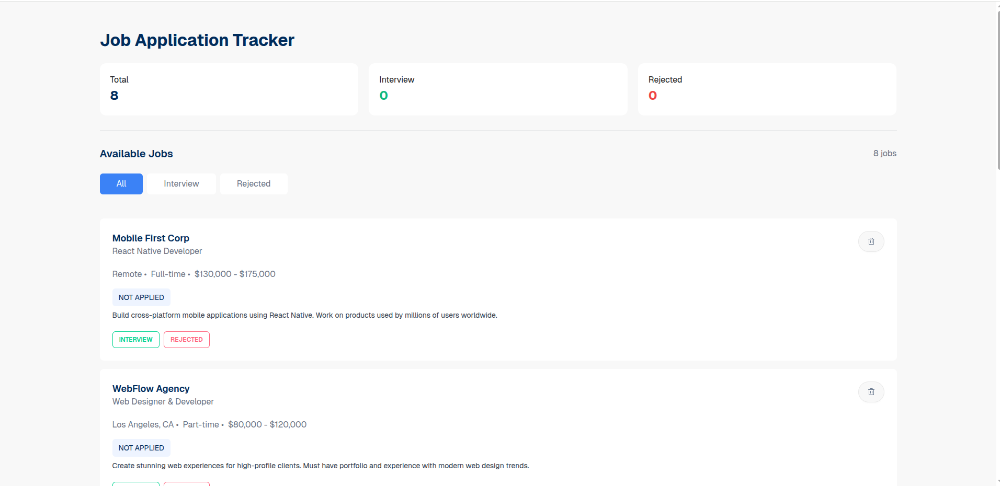
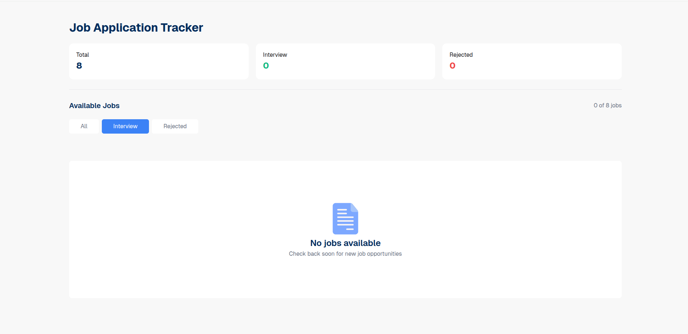
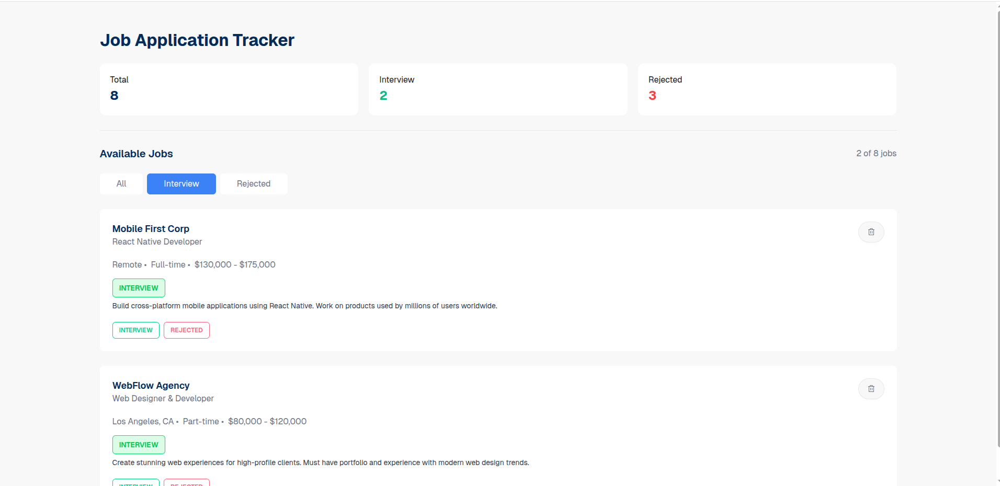
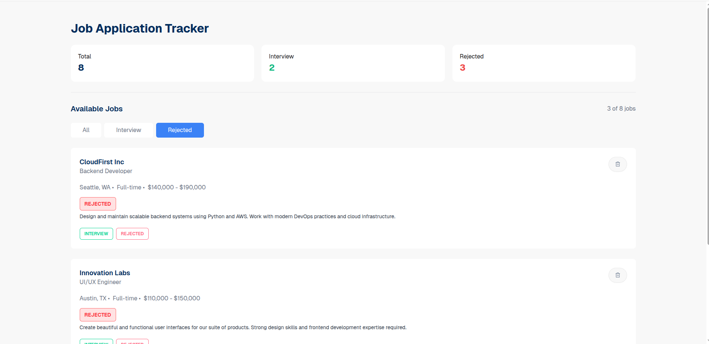

# Job Application Tracker 🚀

A simple and interactive **Job Application Tracker** built with HTML, Tailwind CSS (DaisyUI), and JavaScript. Easily track your job applications, interviews, and rejections with a modern, responsive interface.

---
## 📸 Project Demo

  
   
  
  

---

## 🔗 Live Demo
[Live Project](https://kouser-ahamed.github.io/B13-Assignment-04-kouserahamed420/)

---

## 📝 Project Overview

The **Job Application Tracker** is designed to help job seekers monitor their applications efficiently. Users can:

- Track total jobs, interviews, and rejections.  
- Filter jobs by status: All, Interview, or Rejected.  
- Update job status dynamically.  
- Delete jobs when no longer needed.  

This project emphasizes a clean UI, usability, and responsive design for desktop and mobile.

---

## 🛠️ Technologies Used

- **HTML5**  
- **CSS3** with **Tailwind CSS** + **DaisyUI**  
- **JavaScript (Vanilla)**  
- Google Fonts: *Geist*

---

## ⚡ Core Features

- Dynamic **Job Counters** (Total, Interviews, Rejected).  
- Status Update Buttons: **INTERVIEW ✅** or **REJECTED ❌**.  
- Filtering: Show All, Interview, or Rejected jobs.  
- Delete jobs from any list.  
- Responsive UI for all device sizes.  

---

## 📦 Dependencies

- **Tailwind CSS** (via CDN)  
- **DaisyUI** (via CDN)  
- No backend or database; fully frontend-based.

---

## 🏗️ Project Structure

```

Job-Application-Tracker/
│
├─ index.html
├─ style.css
├─ script.js
├─ image/
│   └─ JobApplicationDemoPic/
│       ├─ job-1.png
│       ├─ job-2.png
│       ├─ job-3.png
│       └─ job-4.png
└─ README.md

````

---

## 💻 Local Setup Guide

1. Clone the repository:

```bash
git clone https://github.com/kouser-ahamed/B13-Assignment-04-kouserahamed420.git
````

2. Open `index.html` in your browser.

3. Use the interface to:

   * Add job statuses: INTERVIEW or REJECTED.
   * Filter jobs using buttons.
   * Delete jobs when done.

---

## 🎓 Learning Outcomes

* Managing state dynamically with JavaScript.
* Conditional rendering based on user interactions.
* Creating reusable components with HTML + Tailwind.
* Building a clean, professional UI without frameworks.

---

## 🚀 Future Improvements

* Add **user authentication** to save personal jobs.
* Integrate a **backend database** for persistent data.
* Implement **drag-and-drop** job status updates.
* Add **dark mode** toggle for UI.

---

## ✅ Conclusion

The **Job Application Tracker** is a lightweight, frontend-focused project that demonstrates state management, filtering, and dynamic UI updates using modern CSS and JavaScript.

---

## 🔗 Links

* **Live Demo:** [https://kouser-ahamed.github.io/B13-Assignment-04-kouserahamed420/](https://kouser-ahamed.github.io/B13-Assignment-04-kouserahamed420/)
* **GitHub Repo:** [https://github.com/kouser-ahamed/B13-Assignment-04-kouserahamed420](https://github.com/kouser-ahamed/B13-Assignment-04-kouserahamed420)


# B13-Assignment-04

## 1. Difference between getElementById, getElementsByClassName, and querySelector / querySelectorAll 

getElementById: With this, one element is found with its ID. ID is unique, therefore it will always pick one.
getElementsByClassName: By this we are able to find all the elements which share the same class name. It Returns a list of elements.
querySelector: It uses it to find the first element which matches any CSS selector.
querySelectorAll: With the help of it, all the elements that correspond to any CSS finder are located. It also gives a list of elements such as class name.

## 2. How to create and insert a new element into the DOM

Start by creating a new memory element. Make a fresh div element.  
Secondly, include some content or text within it. Put some text inside of it.  
Third, make it visible by inserting it into the page. Put it on the page.

## 3. What is Event Bubbling? How does it work?

Bubbling of event occurs when an event is clicked on an element and then the event is automatically sent to its parents.

As an example, when a button is clicked within a div:
First the button receive the click.
Then the div
Then the body
Then html

## 4. What is Event Delegation? Why is it useful?

Event Delegation implies to add one event listener to parent. This is one listener which may serve all child elements.

It is very useful because:
Does not require event listening on all children.
It is also applicable to new elements that are subsequently introduced within the parent.

## 5. Difference between preventDefault() and stopPropagation()

preventDefault: The prevents the default of an element. The point is that a link will not take up a new page or a form will not submit.
stopPropagation(): Prevents the event propagation to the parent elements. The incident will remain on the surface on which it occurred.

